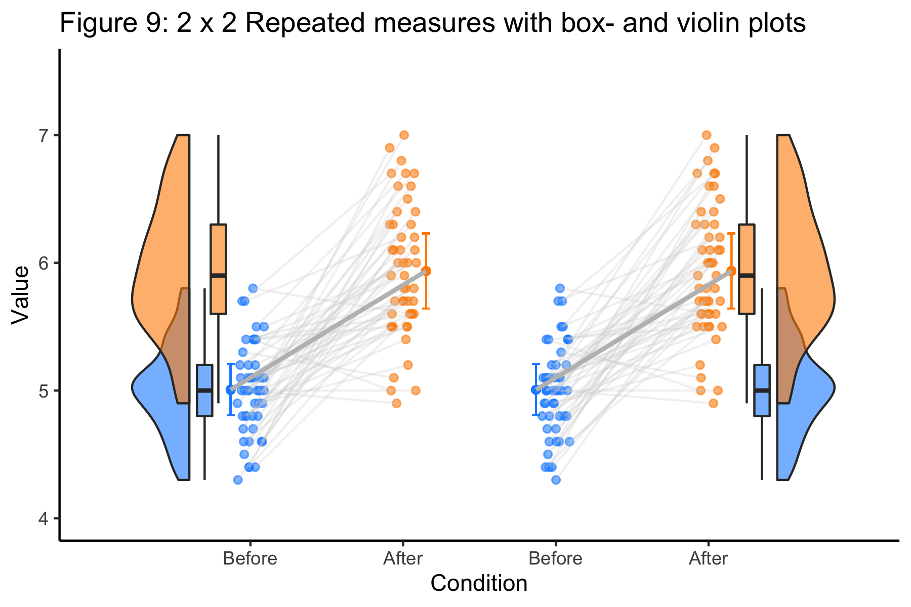
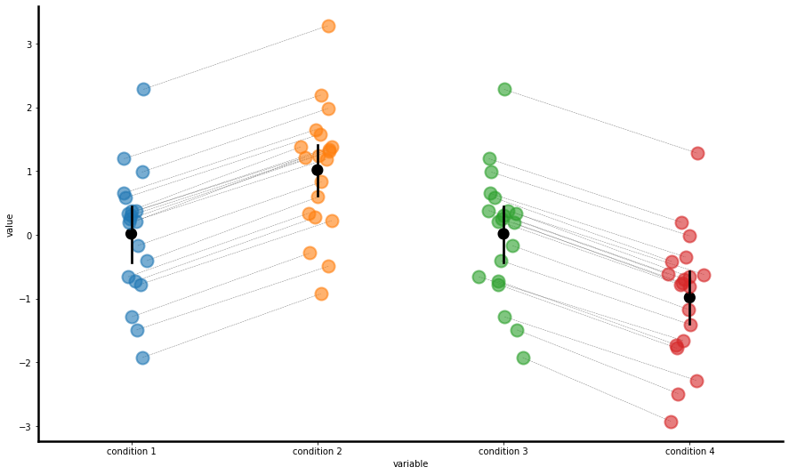

# open-visualizations
Visualizations based on best open science practices.

This repository currently includes visualizations made with:
- Python (.ipynb)
- R (.rmd)

Some of the work in R is inspired by work from Neuroscientist Micah Allen et al.  (2019). The idea behind the ‘open-visualizations’ repository stems from the fact that (open) science - in general - lacks ‘fully’ transparent and robust visualizations, i.e., figures have always some form of ‘hidden-data’. In line with the open-science naming, I came up with: open-visualiziations. To overcome the issue of figures that include ‘hidden-data’,I initially created a Jupyter Notebook written in Python (see folder Python). After posting a Tweet on Twitter, in which I stated that I was working on ‘open-visualizations’, Neuroscientist Micah Allen replied and advised me to check out his work on Rainclouds. After performing two of their tutorials, in R and Python respectively, I thought of a way to combine the raincloud approach with my own work performed in Python. Shortly after posting another Tweet which included some figures that I produced in R, I received a huge amount of encouraging feedback which led me to writing a tutorial in R-markdown. If you have any questions, suggestions for improvement or identify bugs, please open an issue in this repository.   

If you use my repository for your research, please reference it (see DOI above).

References:

Allen, M., Poggiali, D., Whitaker, K., Marshall, T. R., & Kievit, R. A. (2019). Raincloud plots: a multi-platform tool for robust data visualization. Wellcome open research, 4.
