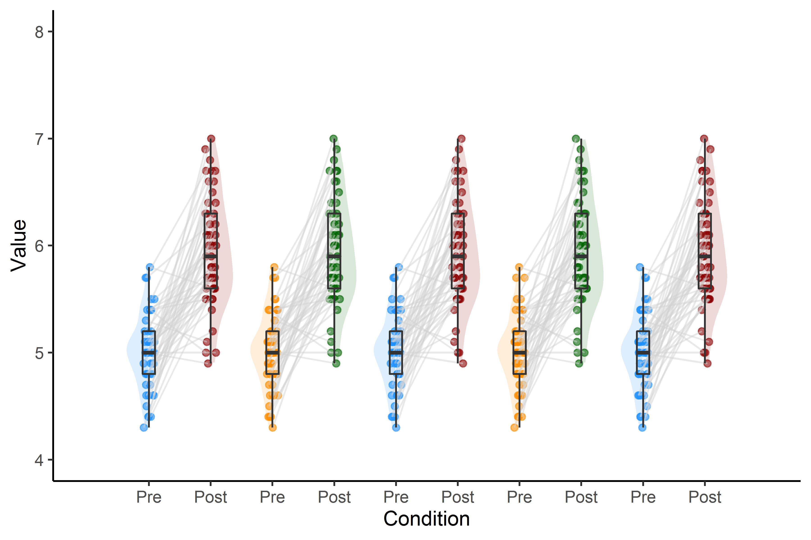
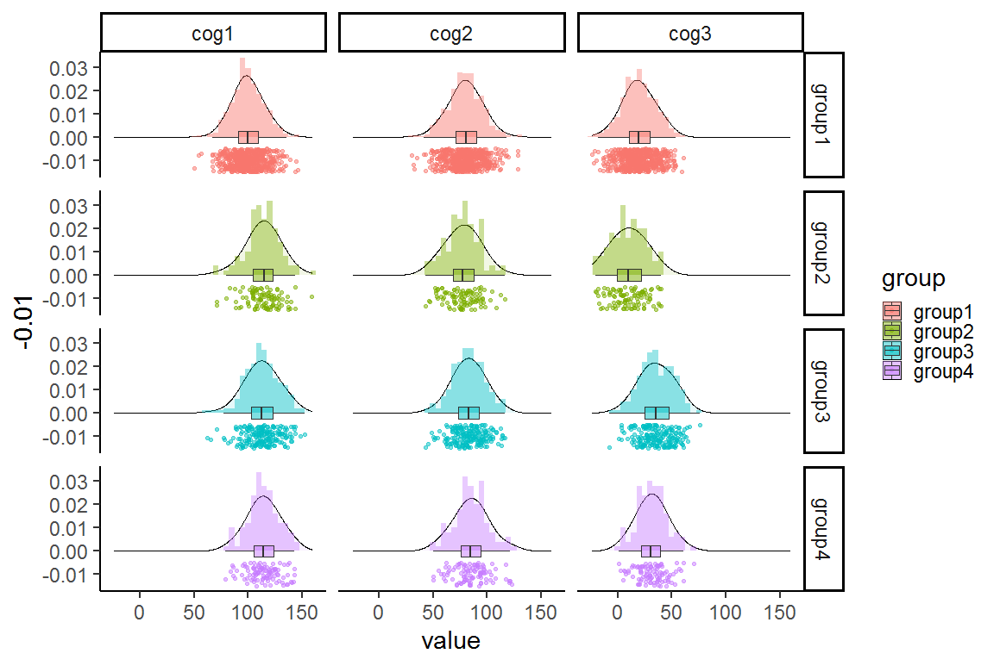
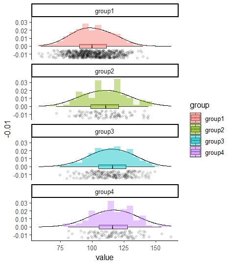
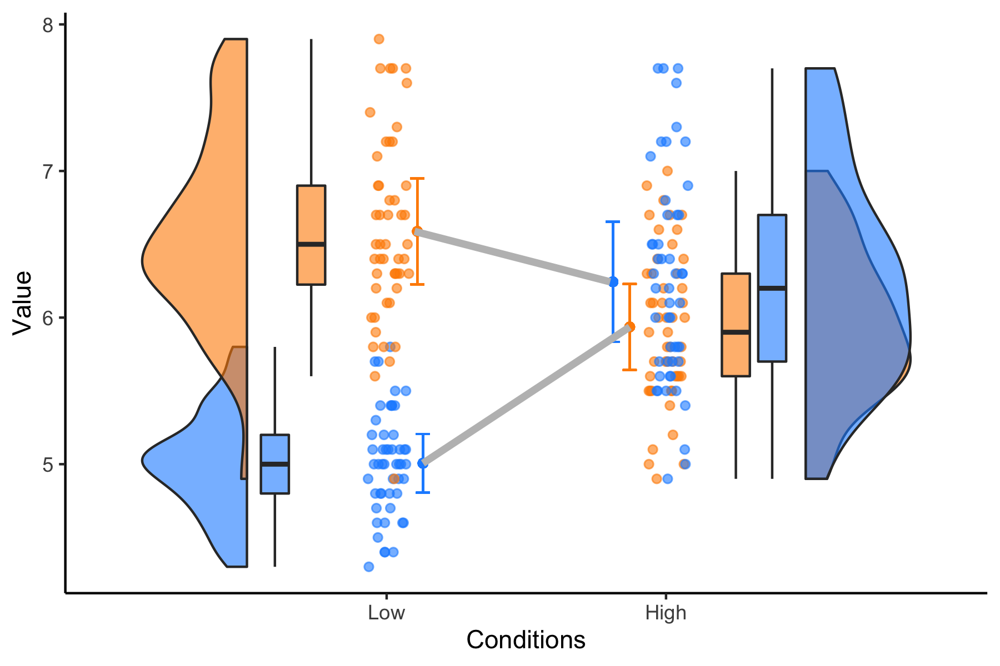
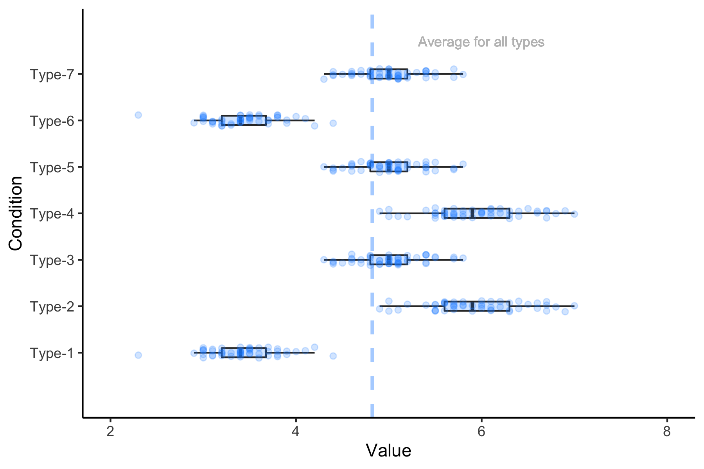
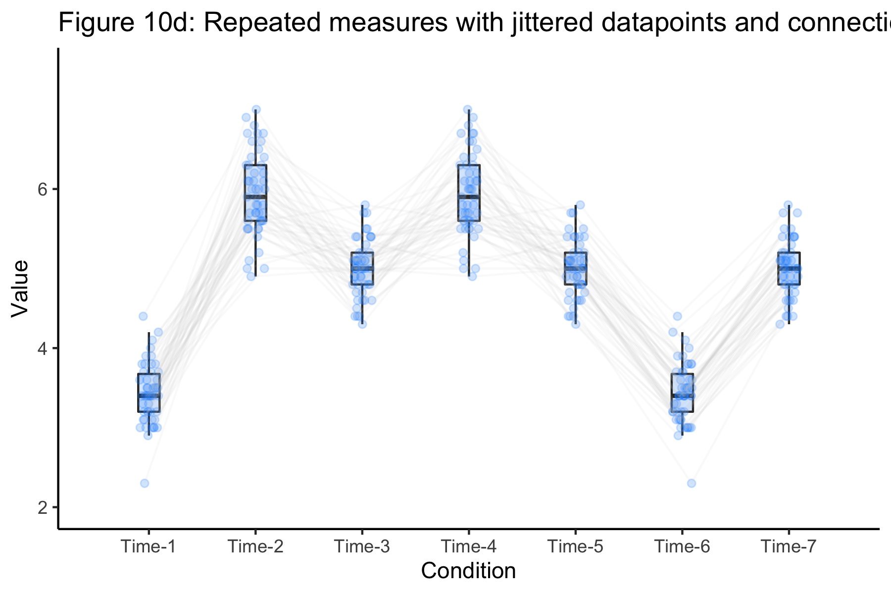
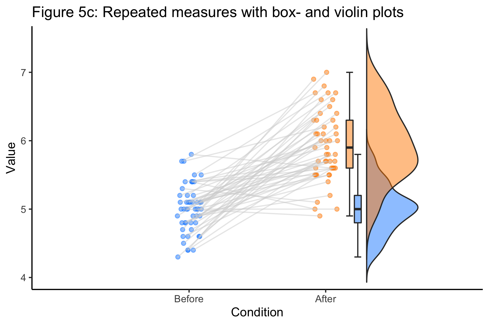
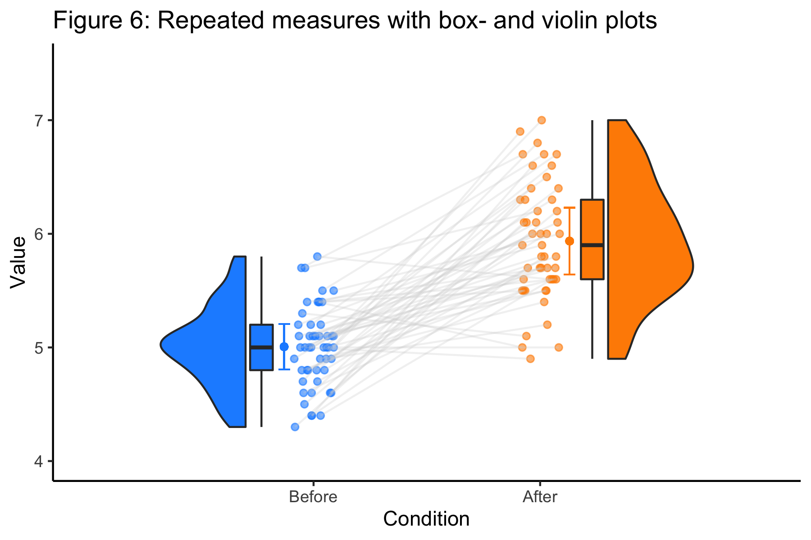
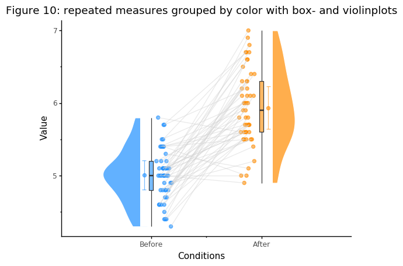

# open-visualizations

If you use this repository for your research, please cite it, thank you.

<pre>
- van Langen, J. (2020). Open-visualizations in R and Python. 
<a href="https://github.com/jorvlan/open-visualizations">https://github.com/jorvlan/open-visualizations</a>
</pre>

This repository has been used by:

### 2021
<pre>
<b>*</b> Daeglau, M., et al., (2021). 
    Event-related desynchronization in motor imagery with EEG neurofeedback 
    in the context of declarative interference and sleep. 
    <b>Neuroimage: Reports</b>, 1(4), 100058.
    <a href="https://doi.org/10.1016/j.ynirp.2021.100058">https://doi.org/10.1016/j.ynirp.2021.100058</a>
<b>*</b> Garcia, J. M. (2021). 
    Spanish Translation and Validation of the Medication Management Ability Assessment. 
    <b>Senior Honors Thesis / University of Houston Libraries</b>.
    <a href="https://uh-ir.tdl.org/handle/10657/8249">https://uh-ir.tdl.org/handle/10657/8249</a>
<b>*</b> Callaghan, B., et al., (2021). 
    Testing the efficacy of three informational interventions 
    for reducing misperceptions of the Black–White wealth gap. 
    <b>PNAS (Proceedings of the National Academy of Sciences)</b>, 118(38).
    <a href="https://doi.org/10.1073/pnas.2108875118">https://doi.org/10.1073/pnas.2108875118</a> 
<b>*</b> Suetani, S., et al., (2021). 
    Impairments in goal-directed action and reversal learning 
    in a proportion of individuals with psychosis: 
    evidence for differential phenotypes in early and persistent psychosis. 
    <b>medRxiv</b>.
    <a href="https://doi.org/10.1101/2021.08.31.21262937">https://doi.org/10.1101/2021.08.31.21262937</a>
<b>*</b> Motyka, P., et al., (2021). Perceptual Awareness of Optic Flows 
    Paced Optimally and Non-optimally to Walking Speed. 
    <b>Perception</b>, 03010066211034368.
    <a href="https://doi.org/10.1177/03010066211034368">https://doi.org/10.1177/03010066211034368</a>
<b>*</b> Schleider, J. L., et al., (2021). 
    Single-session interventions for adolescent depression 
    in the context of COVID-19: A nationwide randomized-controlled trial.
    <b>PsyArXiv</b>.
    <a href="https://psyarxiv.com/ved4p/">https://psyarxiv.com/ved4p/</a>
<b>*</b> Kang, M. S., & Chiu, Y. C. (2021). 
    Proactive and reactive metacontrol in task switching. 
    <b>Memory & Cognition</b>, 1-16.
    <a href="https://doi.org/10.3758/s13421-021-01189-8">https://doi.org/10.3758/s13421-021-01189-8</a>
<b>*</b> Heirene, R., et al., (2021). 
    Accuracy of self-reported gambling frequency and outcomes: 
    Comparisons with account data.
    <b>PsyArXiv</b>.
    <a href="https://psyarxiv.com/5hs7j/">https://psyarxiv.com/5hs7j/</a>
<b>*</b> Jambazova, A. A. (2021). Studying the behavioural, physiological, 
    and neural indices of associative learning in multi-trial paradigms: 
    methodological and analytical considerations 
    <b>(Doctoral dissertation, University of Glasgow)</b>.
    <a href="http://theses.gla.ac.uk/82335/">http://theses.gla.ac.uk/82335/</a>
<b>*</b> Trupp, M., et al., (2021). Can a brief interaction with online, 
    digital art improve wellbeing?: 
    A comparative study of the impact of online art and culture presentations 
    on mood, state-anxiety, subjective wellbeing, and loneliness.
    <b>PsyArXiv</b>.
    <a href="https://psyarxiv.com/93atj/">https://psyarxiv.com/93atj/</a>
<b>*</b> Bejjani, C., et al., (2021). Evaluating the learning of stimulus-control associations 
    through incidental memory of reinforcement events. 
    <b>Journal of Experimental Psychology: Learning, Memory, and Cognition</b>. 
    <a href="https://doi.org/10.1037/xlm0001058">https://doi.org/10.1037/xlm0001058</a>
<b>*</b> Wynn, J.S., et al., (2021). Encoding and retrieval eye movements 
    mediate age differences in pattern completion. 
    <b>Cognition</b>. 
    <a href="https://doi.org/10.1016/j.cognition.2021.104746">https://doi.org/10.1016/j.cognition.2021.104746</a>
<b>*</b> Bellmund, J., et al., (2021). Structuring time: The hippocampus constructs 
    sequence memories that generalize temporal relations across experiences.
    <b>bioRxiv</b>.
    <a href="https://doi.org/10.1101/2021.04.23.440002">https://doi.org/10.1101/2021.04.23.440002</a>
<b>*</b> Allen, M., et al., (2021). Raincloud plots: A multi-platform tool for robust data visualization
    [version 2; peer review: 2 approved].
    <b>Wellcome Open Research</b>.
    <a href="https://wellcomeopenresearch.org/articles/4-63/v2">https://wellcomeopenresearch.org/articles/4-63/v2</a>
<b>*</b> Kuhn, M., et al., (2021). Navigating the manifold of skin conductance response 
    quantification approaches.
    <b>PsyArXiv</b>.
    <a href="https://psyarxiv.com/9h2kd">https://psyarxiv.com/9h2kd</a>
<b>*</b> Voulgaropoulou, S., et al., (2021). Asymmetric effects of acute stress on cost and benefit learning.
    <b>bioRxiv</b>. 
    <a href="https://doi.org/10.1101/2021.04.25.441347">https://doi.org/10.1101/2021.04.25.441347</a>
<b>*</b> Mosley, P.E., et al., A randomised, double-blind,
    sham-controlled trial of deep brain stimulation 
    of the bed nucleus of the stria terminalis for treatment-resistant obsessive-compulsive disorder. 
    <b>Translational Psychiatry</b>. 11, 190 (2021). 
    <a href="https://doi.org/10.1038/s41398-021-01307-9">https://doi.org/10.1038/s41398-021-01307-9</a>
<b>*</b> Hur, J., et al., (2021). Anxiety-related frontocortical activity is associated with 
    dampened stressor reactivity in the real world.
    <b>bioRxiv</b>. <a href="https://doi.org/10.1101/2021.03.17.435791">https://doi.org/10.1101/2021.03.17.435791</a>
<b>*</b> Kuhrt, D., et al., (2021). An immersive first-person navigation task 
    for abstract knowledge acquisition. 
    <b>Scientific Reports</b>. 11, 5612. 
    <a href="https://doi.org/10.1038/s41598-021-84599-7">https://doi.org/10.1038/s41598-021-84599-7</a>
<b>*</b> JASP Team (2021). JASP - A Fresh Way to Do Statistics [Computer software].
    <b>Release version 0.15</b>.
    <a href="https://jasp-stats.org/">https://jasp-stats.org/</a>
<b>*</b> Somasundaram, V., et al., (2021). Contingency learning is not modulated by 
    cognitive control demands.
    <b>PsyArXiv</b>. <a href="https://psyarxiv.com/z5ngw/">https://psyarxiv.com/z5ngw/</a>
<b>*</b> Pálffy, Z., et al., (2021). Cross-modal auditory priors drive 
    the perception of bistable visual stimuli with reliable differences between individuals. 
    <b>PsyArXiv</b>. <a href="https://psyarxiv.com/kj5cf/">https://psyarxiv.com/kj5cf/</a>
<b>*</b> Altay, S., et al., (2021). Information Delivered by a Chatbot 
    Has a Positive Impact on COVID-19 Vaccines Attitudes and Intentions.
    <b>PsyArXiv</b>. <a href="https://psyarxiv.com/eb2gt/">https://psyarxiv.com/eb2gt/</a>
</pre>

### 2020    
<pre>
<b>*</b> Legrand, N., et al., (2020). Emotional metacognition: stimulus valence modulates 
    cardiac arousal and metamemory.
    <b>Cognition and Emotion</b>, 1-17. <a href="https://doi.org/10.1080/02699931.2020.1859993">https://doi.org/10.1080/02699931.2020.1859993</a>
<b>*</b> Petzka, M., et al., (2020). Does sleep-dependent consolidation favour weak memories?
    <b>Cortex</b>, 134, 65-75. <a href="https://doi.org/10.1016/j.cortex.2020.10.005">https://doi.org/10.1016/j.cortex.2020.10.005</a>
<b>*</b> Plotnine: A grammar of graphics for Python (2020). 
    <b>GitHub</b>. <a href="https://github.com/has2k1/plotnine">https://github.com/has2k1/plotnine</a>
    <b>readthedocs</b>. <a href="https://plotnine.readthedocs.io/en/stable/">https://plotnine.readthedocs.io/en/stable/</a>
<b>*</b> Burley, D. T., et al., (2020). Childhood conduct problems are associated with reduced 
    white matter fibre density and morphology. 
    <b>Journal of Affective Disorders</b>. <a href="https://doi.org/10.1016/j.jad.2020.11.098">https://doi.org/10.1016/j.jad.2020.11.098</a>
<b>*</b> Daeglau, M., et al., (2020). Motor Imagery EEG neurofeedback skill acquisition 
    in the context of declarative interference and sleep. 
    <b>bioRxiv</b>. <a href="https://doi.org/10.1101/2020.12.11.420919">https://doi.org/10.1101/2020.12.11.420919</a> 
<b>*</b> Weiss, B., et al., (2020). 
    Examining Changes in Personality Following Shamanic Ceremonial Use of Ayahuasca.
    <b>Research Square</b>. <a href="https://www.researchsquare.com/article/rs-111130/v1">https://www.researchsquare.com/article/rs-111130/v1</a>
<b>*</b> Wiwad, D. et al., (2020).
    The impact of COVID-19 on attitudes toward poverty and inequality.
    <b>Journal of Experimental Social Psychology</b>. <a href="https://doi.org/10.1016/j.jesp.2020.104083">https://doi.org/10.1016/j.jesp.2020.104083</a>
<b>*</b> Wiwad, D., et al., (2020).
    Recognizing the Impact of Covid-19 on the Poor Alters Attitudes Towards Poverty and Inequality.
    <b>PsyArXiv</b>. <a href="https://psyarxiv.com/geyt4/">https://psyarxiv.com/geyt4/</a>
<b>*</b> Ehlers, M.R., et al., (2020). 
    Revisiting potential associations between brain morphology, 
    fear acquisition and extinction through new data and a literature review. 
    <b>Scientific Reports</b>. <a href="https://doi.org/10.1038/s41598-020-76683-1">https://doi.org/10.1038/s41598-020-76683-1</a>
<b>*</b> Bejjani, C., et al., (2020). 
    Minimal impact of consolidation on learned switch-readiness.
    <b>bioRxiv</b>. <a href="https://psyarxiv.com/5ewj6/">https://psyarxiv.com/5ewj6/</a>
<b>*</b> Mosley, P., et al., (2020). 
    A Randomised, Double-Blind, Sham-Controlled 
    Trial of Deep Brain Stimulation of the Bed Nucleus of the Stria Terminalis 
    for Treatment-Resistant Obsessive-Compulsive Disorder. 
    <b>medRxiv</b>. <a href="https://www.medrxiv.org/content/10.1101/2020.10.24.20218024v1">https://www.medrxiv.org/content/10.1101/2020.10.24.20218024v1</a>
<b>*</b> Kuhrt, D., et al., (2020). 
    An immersive first-person navigation task for abstract knowledge acquisition. 
    <b>bioRxiv</b>. <a href="https://www.biorxiv.org/content/10.1101/2020.07.17.208900v1">https://www.biorxiv.org/content/10.1101/2020.07.17.208900v1</a>
<b>*</b> Hatano, A., et al., (2020).
    Thinking about thinking: People Underestimate Intrinsically Motivating Experiences of Waiting
    <b>PsyArXiv</b>. <a href="https://psyarxiv.com/r6mde">https://psyarxiv.com/r6mde</a>
<b>*</b> Medel, V., et al., (2020). 
    Complexity and 1/f slope jointly reflect cortical states across different E/I balances. 
    <b>bioRxiv</b>. <a href="https://doi.org/10.1101/2020.09.15.298497">https://doi.org/10.1101/2020.09.15.298497</a>
<b>*</b> Genc, S., et al., (2020). 
    Longitudinal patterns of white matter fibre density and morphology in children 
    is associated with age and pubertal stage. 
    <b>Developmental Cognitive Neuroscience</b>, 100853. <a href="https://doi.org/10.1016/j.dcn.2020.100853">https://doi.org/10.1016/j.dcn.2020.100853</a>
<b>*</b> Mosley, P., et al.,(2020). 
    Subthalamic Deep Brain Stimulation Identifies Frontal Networks Supporting Initiation, 
    Inhibition and Strategy Use in Parkinson's Disease: Initiation and Inhibition after 
    STN-DBS for PD. 
    <b>NeuroImage</b>, 117352. <a href="https://doi.org/10.1016/j.neuroimage.2020.117352">https://doi.org/10.1016/j.neuroimage.2020.117352</a>
<b>*</b> Genc, S., et al., (2020). 
    Longitudinal white matter development in child-ren is associated with puberty, 
    attentional difficulties and mental health. 
    <b>bioRxiv</b>, 607671. <a href="https://www.biorxiv.org/content/10.1101/607671v2">https://www.biorxiv.org/content/10.1101/607671v2</a>
<b>*</b> Wynn J., et al., (2020). 
    Encoding and retreival eye movements mediateage differences in pattern completion. 
    <b>PsyArXiv</b>. <a href="https://psyarxiv.com/mdx3f/">https://psyarxiv.com/mdx3f/</a>
<b>*</b> Ehlers, M.R, et al., (2020). 
    Natural variations in brain morphology do not account for inter-individual 
    differences in defensive responding during fear acquisition training and extinction. 
    <b>PsyArXiv</b>. <a href="https://psyarxiv.com/q2kyf/">https://psyarxiv.com/q2kyf/</a>
<b>*</b> Uhlig, M., & Gaebler, M. (2020, July 27). 
    Rapid brain changes following acute psychosocial stress. 
    <b>OSF</b> <a href="https://osf.io/vw2zb/">https://osf.io/vw2zb/</a>
<b>*</b> Bejjani, C., & Egner, T. (2020). 
    How reinforcement shapes the binding of stimulus-control associations. 
    <b>PsyArXiv</b>. <a href="https://psyarxiv.com/cdpxh/">https://psyarxiv.com/cdpxh/</a>
<b>*</b> Wiedemann (2020). 
    lcsm: Univariate and Bivariate Latent Change Score Modeling.
    <b>CRAN</b> <a href="https://cran.r-project.org/web/packages/lcsm/vignettes/v0-longitudinal-plots.html">https://cran.r-project.org/web/packages/lcsm/vignettes/v0-longitudinal-plots.html</a>
</pre> 

Visualizations based on best open science practices.
# Made in R

# Made in R

# Made in R

# Made in R

# Made in R

# Made in R

# Made in R

# Made in R

# Made in R

# Made in R

# Made in R

# Made in Python

This repository currently includes visualizations made with:
- Python (.ipynb)
- R (.rmd)

## Update 15 January 2021: 

Now there is a fully functional R-package ['raincloudplots'](https://github.com/jorvlan/raincloudplots) to make it even easier to create these visualizations for your research.
The package has been incorporated in the following paper:
<pre>
- Allen, M., Poggiali, D., Whitaker, K., Marshall, T. R., <b>van Langen, J.</b>, & Kievit, R. A. 
    Raincloud plots: a multi-platform tool for robust data visualization [version 2; peer review; 2 approved]
    <b>Wellcome Open Research</b> 2021, 4:63. <a href="https://doi.org/10.12688/wellcomeopenres.15191.2">https://doi.org/10.12688/wellcomeopenres.15191.2</a>
</pre>

## Update 10 Augustus 2020:
Development of a R package has started and a first version is expected to be completed by September 2020.

## Update 30 April - 2020: 
Thanks to the overwhelming feedback on Twitter, and thanks to Micah Allen, I will try to implement some comments and upload an updated version somewhere in the next two months. It might be that, due to the recent Rstudio update, some package versions don't work anymore e.g., gghalves. If you encounter this problem, please try to install those packages from CRAN and if that doesn't work, try to install it from the respective GitHub package page. 

# Interactive tutorials
Both Python tutorials and the R tutorial are directly available through Binder. Click on the Binder launcher to open them! 

NOTE: if you want to open the R tutorial with Binder and use RStudio, you'll have to select RStudio within the Jupyter environment by - inside the R folder - clicking: 'new' -> 'RStudio'. This will open RStudio in Binder. If you perform the R tutorial in Binder, the error:`Error in grid.newpage() : could not open file ...` occurs when using ggsave. At this stage, I don't know how to fix this issue, but the figure will be presented, so please ignore this error.

# Background
The idea behind the ‘open-visualizations’ repository stems from the fact that (open) science - in general - lacks ‘fully’ transparent and robust visualizations, i.e., figures have always some form of ‘hidden-data’. To overcome this issue, I created this repository. Some of the work in R is inspired by work from Allen et al. (2019)(https://github.com/RainCloudPlots/RainCloudPlots)

There is a zenodo (https://doi.org/10.5281/zenodo.3715576) archive of the code and this repository is made available under the MIT license i.e., you can do with it what you want, but if you use it, reference needs to be given to the author of this repository.

<pre>
van Langen, J. (2020). Open-visualizations in R and Python. 
<a href="https://github.com/jorvlan/open-visualizations">https://github.com/jorvlan/open-visualizations</a>
</pre>

I hope that these tutorials are helpful for your research and if you have any questions, suggestions for improvement or identify bugs, please open an issue in this repository. 
