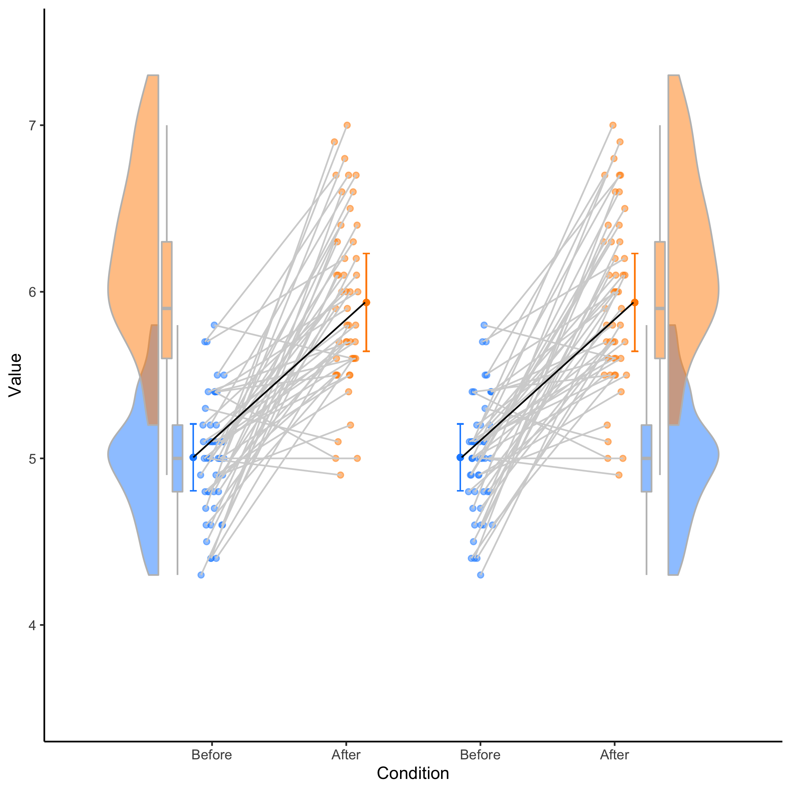
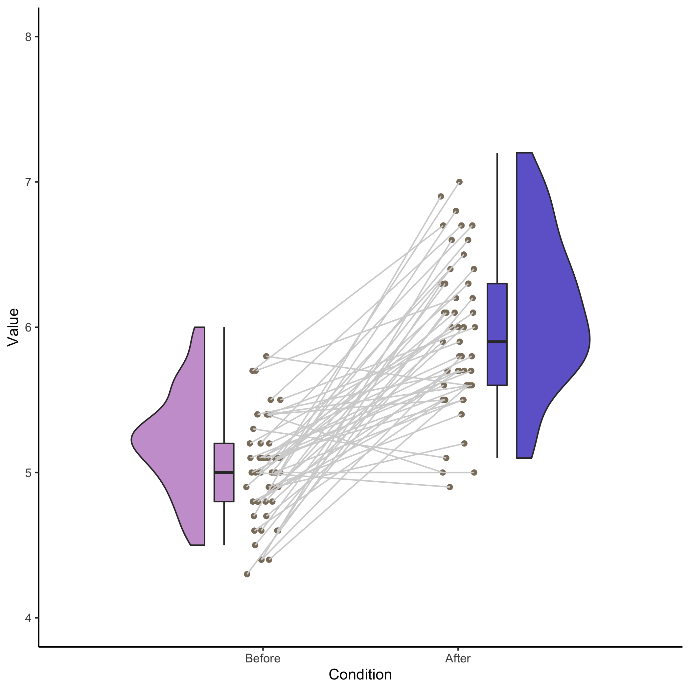
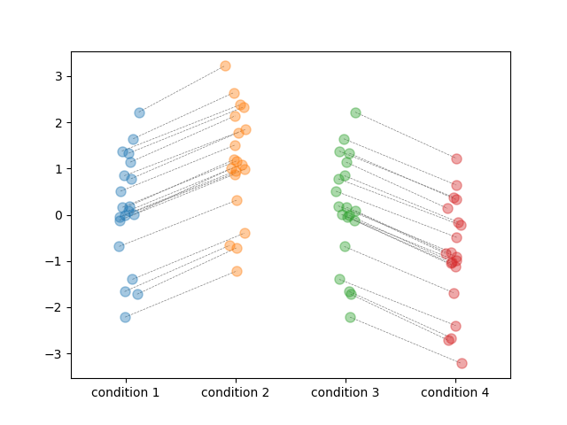

# open-visualizations
Visualizations based on best open science practices.

This repository currently includes visualizations made with:
- Python (Jupyter notebooks)
- R (R markdown)

Will soon upload the R markdown template for the figures made in R

More to come... 
- e.g., time-series, lineplots, etc.
 
