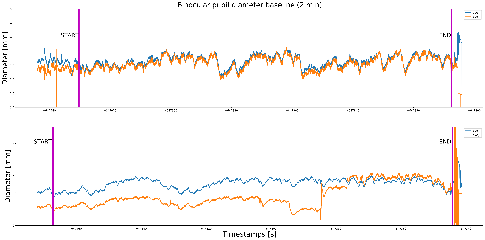

# open-visualizations
Visualizations based on best open science practices.

This repository currently includes visualizations made with:
- Python (.ipynb)
- R (.rmd)

 The r-markdown template for the figures made in R will be uploaded soon.

More to come... 
- e.g., time-series, lineplots, etc.
 
