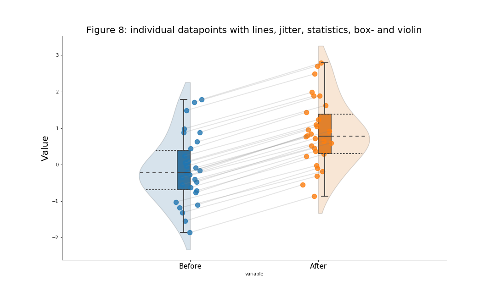
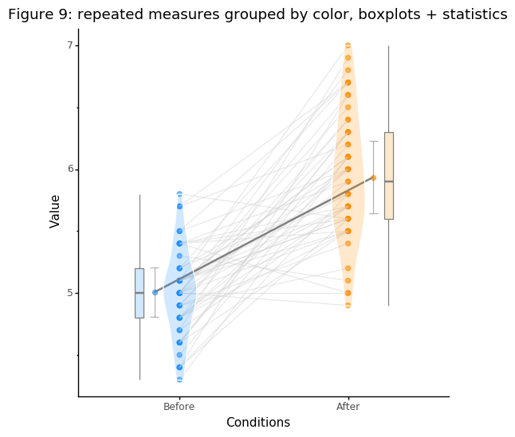

# open-visualizations
Visualizations based on best open science practices.

This repository currently includes visualizations made with:
- Python (.ipynb)
- R (.rmd)

The idea behind the ‘open-visualizations’ repository stems from the fact that (open) science - in general - lacks ‘fully’ transparent and robust visualizations, i.e., figures have always some form of ‘hidden-data’. To overcome this issue, I created this repository. So far I've uploaded an R tutorial and am currently working on a tutorial in Python, which I hope to upload soon. Both R and python tutorial will be put in a binder tutorial. Some of the work in R is inspired by work from Allen et al. (2019). 

If you have any questions, suggestions for improvement or identify bugs, please open an issue in this repository.   

If you use my repository for your research, please reference it (see the DOI above).

References:

Allen, M., Poggiali, D., Whitaker, K., Marshall, T. R., & Kievit, R. A. (2019). Raincloud plots: a multi-platform tool for robust data visualization. Wellcome open research, 4.
